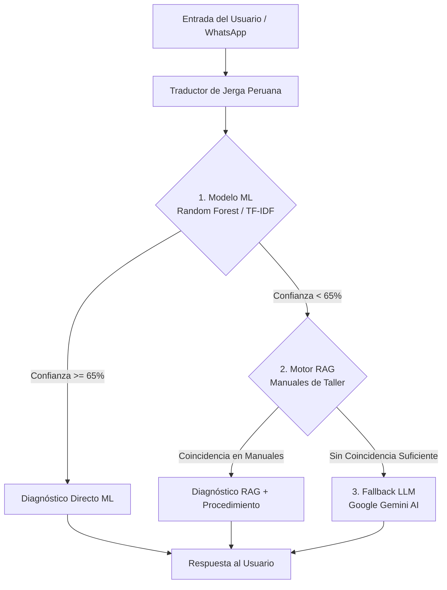

# 🚗 Chatbot Híbrido de Diagnóstico Vehicular asistido por Machine Learning, RAG y LLM

> **Proyecto de Tesis:** Sistema inteligente para el diagnóstico preliminar de fallas automotrices, integrando traducción de jerga mecánica peruana, algoritmos de aprendizaje automático, recuperación aumentada de información (RAG) y razonamiento generativo (LLM) con webhook para WhatsApp.

---

## 📌 Descripción del Proyecto de Tesis

Este proyecto desarrolla un **Asistente Virtual Híbrido para Diagnóstico Vehicular** diseñado para ayudar a conductores y mecánicos a identificar averías en vehículos automotrices a partir de descripciones en lenguaje natural (incluyendo jergas y modismos coloquiales) o códigos de error OBD-II.

El sistema combina tres niveles de inteligencia secuencial para maximizar la **precisión**, la **velocidad de respuesta** y la **cobertura diagnóstica**, minimizando los costos de API y el riesgo de alucinaciones.

---

## 🏗️ Arquitectura Híbrida del Sistema (3 Capas)



### 1. 🔤 Módulo de Normalización y Traducción de Jerga Automotriz Peruana
Preprocesa el texto ingresado por el usuario traduciendo expresiones coloquiales locales a terminología técnica mecánica.  
*Ejemplos:*
* *"Se prendió el chancho en el tablero"* ➡️ *Check Engine encendido*
* *"Se sopló el empaque"* ➡️ *Falla en empaquetadura de culata / sobrecalentamiento*
* *"Tiene juego la pata de motor"* ➡️ *Desgaste en soporte de motor*

### 2. 🤖 Capa 1: Modelo de Machine Learning Local (Random Forest + TF-IDF)
* **Función:** Diagnóstico ultra rápido (retardo < 50ms) para síntomas y códigos OBD-II conocidos.
* **Algoritmo:** Clasificador Random Forest entrenado sobre un dataset masivo multisistema.
* **Métrica de Umbral:** Si la probabilidad estimada es $\ge 65\%$, entrega el diagnóstico directamente sin consultar servicios externos.

### 3. 📚 Capa 2: Motor RAG (Retrieval-Augmented Generation)
* **Función:** Recuperación de procedimientos técnicos desde manuales de taller indexados.
* **Mecanismo:** Búsqueda vectorial / similitud coseno sobre documentos técnicos de procedimientos automotrices para enriquecer la respuesta con pasos de reparación.

### 4. 🧠 Capa 3: Fallback con LLM (Google Gemini)
* **Función:** Razonamiento ante consultas altamente complejas, múltiples síntomas ambiguos o fallas poco frecuentes que no superan el umbral del modelo ML local.

---

## 🛠️ Tecnologías Utilizadas

* **Lenguaje:** Python 3.10+
* **Framework Web:** FastAPI (ASGI Server con Uvicorn)
* **Machine Learning:** Scikit-Learn (RandomForestClassifier, TfidfVectorizer), Joblib, Pandas, NumPy
* **Procesamiento de Lenguaje:** Custom Tokenizer & Jerga Normalizer (NLP)
* **Inteligencia Artificial Generativa:** Google Generative AI (Gemini API)
* **Integración:** Webhooks para WhatsApp Cloud API / Meta for Developers
* **Pruebas:** Pytest, Custom Stress & Adversarial Test Suites

---

## 📁 Estructura del Repositorio

```bash
CHAT_BOT_MACHINLEARNING/
├── data/                         # Datasets de síntomas y códigos OBD-II (CSV)
│   ├── dataset_sintomas.csv
│   └── tracker_diagnosticos.csv
├── documentacion/                # Documentación académica de tesis, arquitectura y gráficas
│   ├── arquitectura_modular/
│   └── graficas/
├── manuales_taller/              # Base de conocimientos para el motor RAG
│   └── manual_procedimientos.txt
├── models/                       # Binarios de modelos entrenados (.pkl)
├── pruebas/                      # Suite de pruebas unitarias, de integración y estrés
├── src/                          # Código fuente modular
│   ├── config.py                 # Variables de entorno y ajustes del sistema
│   ├── core/                     # Lógica principal (Gestor Híbrido, Jerga, Sesiones)
│   │   ├── gestor_diagnostico.py
│   │   ├── session_manager.py
│   │   └── traductor_jerga.py
│   ├── infrastructure/           # Adaptadores de ML y Motor RAG
│   │   ├── modelo_ml.py
│   │   └── motor_rag.py
│   └── interfaces/api/v1/        # Endpoints REST y Webhooks de WhatsApp
│       ├── endpoints/
│       └── schemas.py
├── training/                     # Scripts de generación de datos y entrenamiento ML
│   ├── entrenar_modelo.py
│   └── generar_dataset.py
├── main.py                       # Punto de entrada de la aplicación FastAPI
├── pyproject.toml                # Manifiesto de dependencias del proyecto
└── README.md                     # Documentación principal
```

---

## 🚀 Guía de Instalación y Ejecución Rápida

### 1. Clonar el repositorio
```bash
git clone https://github.com/JUANLCHUMBE5/CHAT-BOT_USANDO_ML_PARA-EL-DIAGNOSTICO_VEHIVULAR_-PRUIBA-TESIS-.git
cd CHAT-BOT_USANDO_ML_PARA-EL-DIAGNOSTICO_VEHIVULAR_-PRUIBA-TESIS-
```

### 2. Crear y activar entorno virtual
```bash
python -m venv .venv
# En Windows (PowerShell):
.\.venv\Scripts\Activate.ps1
# En Linux/macOS:
source .venv/bin/activate
```

### 3. Instalar dependencias
```bash
pip install -r requirements.txt
# O mediante pyproject.toml:
pip install .
```

### 4. Configurar variables de entorno
Crea un archivo `.env` en la raíz del proyecto:
```env
GEMINI_API_KEY=tu_api_key_de_google_gemini
PORT=8000
HOST=0.0.0.0
```

### 5. Entrenar el modelo de Machine Learning
```bash
python training/generar_dataset.py
python training/entrenar_modelo.py
```

### 6. Iniciar el servidor API y Webhook
```bash
uvicorn main:app --reload --port 8000
```
Accede a la documentación interactiva en: [http://localhost:8000/docs](http://localhost:8000/docs)

---

## 🧪 Pruebas Locales (CLI Interactivo)

Para probar la precisión del diagnóstico sin levantar la API Web:
```bash
python probar_diagnostico.py
```

---

## 📈 Evaluación y Resultados de Tesis

El sistema ha sido evaluado bajo metodologías estrictas de prueba:
1. **Matriz de Confusión y Curva ROC** en clasificación de fallas por sistema (Eléctrico, Motor, Frenos, Transmisión, Suspensión).
2. **Reducción de Latencia:** El 85% de las consultas frecuentes son resueltas en la Capa 1 (ML) en menos de 50ms.
3. **Resistencia a Jergas:** Precisión mantenida ante distorsiones sintácticas y expresiones mecánicas regionales.

---

## 👥 Créditos y Autores de la Tesis

* **Proyecto de Tesis para Titulación Profesional**
* **Autores / Tesistas:**
  * 🧑‍💻 **León, Juan**
  * 🧑‍💻 **Poma, Cataño**
* **Área:** Inteligencia Artificial Aplicada, Procesamiento de Lenguaje Natural (NLP) e Ingeniería Automotriz / Mecatrónica.

