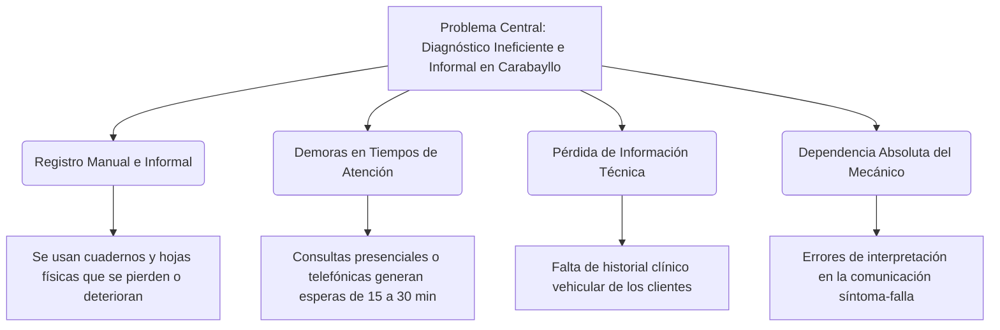

# Análisis del Problema de Investigación y Arquitectura de Software
## Tesis: Chatbot utilizando machine learning para el diagnóstico vehicular en talleres mecánicos en Carabayllo 2026

Este documento detalla el **Problema de Investigación** identificado en tu informe de tesis y justifica técnicamente cómo la **Arquitectura en Capas** propuesta resuelve directamente cada una de las deficiencias detectadas.

---

## 1. El Problema de Investigación (Según el Informe de Tesis)

A partir de tu informe de tesis (Páginas 2, 3, 4 y 7), se identifica que en los talleres mecánicos del distrito de **Carabayllo** existen deficiencias críticas en la gestión del diagnóstico automotriz:



### Síntesis del Problema:
Los talleres mecánicos de Carabayllo realizan diagnósticos empíricos basados principalmente en la experiencia visual y auditiva del técnico. La información de averías y repuestos se registra manualmente, lo que genera demoras en la comunicación con el cliente y aumenta la probabilidad de diagnósticos erróneos debido a la falta de estandarización técnica.

---

## 2. Cómo la Arquitectura en Capas Soluciona el Problema

La implementación del chatbot estructurado bajo la **Arquitectura en Capas (Layered Architecture)** ataca directamente cada dimensión del problema planteado en tu matriz de consistencia:

```
+-----------------------------------------------------------------------------------+
| 1. Capa de Interfaces (FastAPI / WhatsApp)                                        |
| -> Soluciona: Tiempos de espera y canal de comunicación informal.                  |
| -> Cómo: Brinda un canal inmediato 24/7 vía WhatsApp reduciendo el tiempo         |
|          promedio de atención de minutos a segundos.                              |
+-----------------------------------------------------------------------------------+
                                         |
                                         v
+-----------------------------------------------------------------------------------+
| 2. Capa de Lógica de Negocio / Core (audio_processor, gestor_diagnostico)         |
| -> Soluciona: Dependencia de la interpretación subjetiva y falta de precisión.    |
| -> Cómo: Clasifica científicamente los síntomas mediante ML supervisado           |
|          y procesa acústicamente ruidos mecánicos usando FFT sin subjetividades.  |
+-----------------------------------------------------------------------------------+
                                         |
                                         v
+-----------------------------------------------------------------------------------+
| 3. Capa de Infraestructura (modelo_ml, motor_rag, persistencia)                   |
| -> Soluciona: Pérdida de información y falta de estandarización.                  |
| -> Cómo: Indexa manuales de taller reales (RAG) para dar respuestas confiables y  |
|          guarda los reportes automáticamente en logs estructurados (CSV/DB).      |
+-----------------------------------------------------------------------------------+
```

---

## 3. Justificación Arquitectónica para la Defensa

Ante el jurado, debes argumentar la elección de esta arquitectura bajo tres pilares fundamentales de la Ingeniería de Software:

### A. Desacoplamiento de Componentes (Mantenibilidad)
* **El Problema en el Prototipo**: En los scripts planos iniciales, si cambiabas la API de WhatsApp, tenías que modificar las fórmulas del procesamiento de Fourier (FFT) y la carga de los archivos `.pkl`. Esto violaba el principio de diseño de software.
* **La Solución Arquitectónica**: Con la estructura en capas, la **Capa de Interfaces** solo sabe cómo recibir y enviar mensajes HTTPS. La **Capa de Negocio (Core)** procesa la lógica del diagnóstico. La **Capa de Infraestructura** se encarga de leer archivos locales o consultar bases de datos.

### B. Consistencia e Integridad del Diagnóstico (Evitar Alucinación)
* **Justificación técnica RAG**: Al separar el módulo de recuperación semántica (`motor_rag.py`) en la Capa de Infraestructura, el sistema está blindado ante alucinaciones. La lógica de generación conversacional en el Core solo puede redactar respuestas basadas estrictamente en la documentación técnica oficial recuperada.

### C. Eficiencia del Canal (WhatsApp Webhook asíncrono)
* El webhook estructurado en `interfaces/webhook.py` responde inmediatamente a los servidores de Meta con un código HTTP 200, procesando el análisis de diagnóstico de forma asíncrona en hilos de ejecución de FastAPI. Esto asegura que la experiencia de usuario sea fluida y evita que WhatsApp desconecte el bot por demoras de procesamiento de red.
