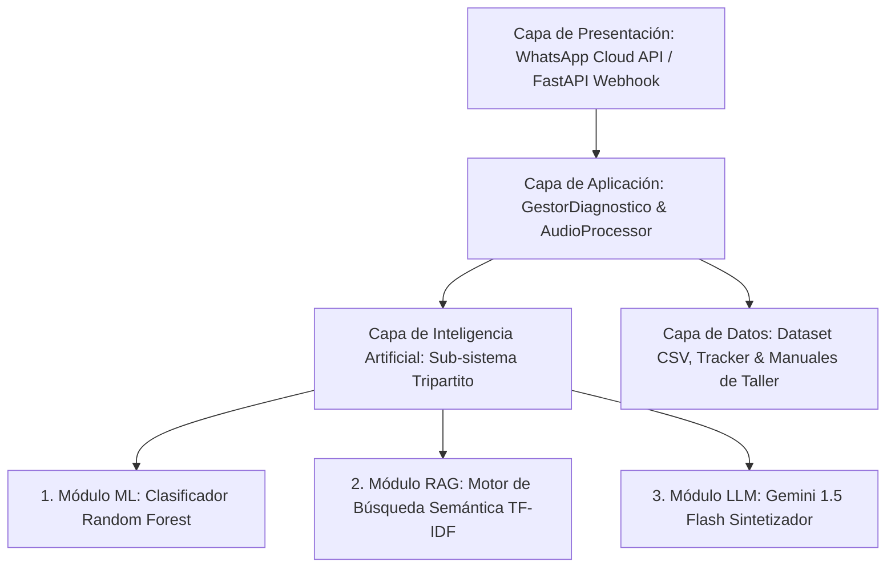

# Arquitectura Modular por Capas y Sub-sistema Tripartito de IA (ML + RAG + LLM)

## 1. Visión General de la Arquitectura
El sistema de **Chatbot Vehicular para Diagnóstico Mecánico** está diseñado bajo una **Arquitectura Modular por Capas (Layered Architecture)** desacoplada. Esta estructura garantiza mantenibilidad, escalabilidad e independencia entre la interfaz conversacional, la lógica de negocio, los motores de Inteligencia Artificial y el almacenamiento persistente.

---

## 2. Descripción Detallada de las 4 Capas del Sistema

### Capa 1: Capa de Presentación (Presentation Layer)
- **Ubicación en Código**: `src/interfaces/api/v1/endpoints/webhook.py`, `src/interfaces/api/v1/router.py`, `main.py`
- **Función**: Maneja la interacción directa con el usuario final y la API de Meta.
- **Componentes principales**:
  - **Webhook WhatsApp**: Recibe peticiones HTTP POST asíncronas desde los servidores de Meta Cloud API cuando un usuario envía un mensaje por WhatsApp.
  - **Verificación de Seguridad (`GET /webhook`)**: Valida la suscripción con el `Verify Token` de Meta.
  - **Respuesta Inmediata (HTTP 200 OK)**: Retorna confirmación HTTP en < 500ms a Meta para evitar caídas de timeout mientras la Capa de IA procesa la consulta.

### Capa 2: Capa de Aplicación (Application Layer)
- **Ubicación en Código**: `src/core/gestor_diagnostico.py`, `src/core/audio_processor.py`
- **Función**: Orquesta el flujo de trabajo del diagnóstico y aplica las reglas de negocio del taller vehicular.
- **Componentes principales**:
  - **`GestorDiagnostico`**: Recibe el síntoma de la Capa de Presentación, coordina la ejecución paralela o secuencial del modelo ML y RAG, y construye el prompt final para el LLM.
  - **`AudioProcessor`**: Procesa señales físicas de audio mediante la Transformada Rápida de Fourier (FFT) y el análisis de Energía RMS en caso de habilitarse el diagnóstico por ruido mecánico.

### Capa 3: Capa de Inteligencia Artificial (Sub-sistema de 3 Modelos)
- **Ubicación en Código**: `src/infrastructure/modelo_ml.py`, `src/infrastructure/motor_rag.py`
- **Función**: Ejecuta las tareas cognitivas divididas en **3 modelos complementarios**:

#### 🤖 Modelo 1: Machine Learning Supervisado (Clasificación Predictiva)
- **Tecnología**: Scikit-Learn (`RandomForestClassifier` + `TfidfVectorizer`).
- **Función**: Analiza la descripción textual del síntoma ingresado por el mecánico o cliente y predice la categoría exacta de la falla vehicular (ej: *"Pastillas de freno desgastadas"*, *"Falla en el alternador"*).
- **Entrada**: Texto crudo del síntoma.
- **Salida**: Etiqueta predictiva de la falla vehicular y nivel de probabilidad/confianza.

#### 📚 Modelo 2: RAG - Retrieval-Augmented Generation (Recuperación Semántica)
- **Tecnología**: TF-IDF Vectorizer + Cosine Similarity sobre `manuales_taller/manual_procedimientos.txt`.
- **Función**: Consulta la base de conocimiento técnica interna del taller para extraer el procedimiento exacto de inspección, reparación o mantenimiento correctivo asociado al problema reportado.
- **Entrada**: Texto de la consulta técnica.
- **Salida**: Fragmento textual exacto del manual técnico de procedimientos del taller Carabayllo.

#### 💬 Modelo 3: LLM - Large Language Model (Sintetizador Conversacional)
- **Tecnología**: Google Gemini 1.5 Flash API (o Fallback estructurado local).
- **Función**: Toma el diagnóstico predictivo del **Modelo ML** y el procedimiento técnico recuperado por el **Modelo RAG**, y los sintetiza en una respuesta conversacional clara, empática, formateada para WhatsApp (con viñetas y emojis) en máximo 2 párrafos.
- **Entrada**: Prompt Aumentado (Consulta + Resultado ML + Contexto RAG).
- **Salida**: Mensaje final enviado al celular del usuario.

### Capa 4: Capa de Datos (Data Layer)
- **Ubicación en Código**: `data/dataset_sintomas.csv`, `data/tracker_diagnosticos.csv`, `models/modelo_diagnostico.pkl`, `manuales_taller/`
- **Función**: Almacenamiento persistente de datos históricos, modelos entrenados binarios y registros de auditoría de diagnóstico.

---

## 3. Beneficios de la Arquitectura Modular para la Tesis
1. **Desacoplamiento Tecnológico**: Se puede reentrenar el modelo ML sin afectar el motor RAG ni la API de WhatsApp.
2. **Robustez y Fallback**: Si el LLM no responde por cuota de API, el sistema utiliza respuestas estructuradas locales sin detener el chatbot.
3. **Escalabilidad**: Facilita la división del trabajo de desarrollo entre dos investigadores.
