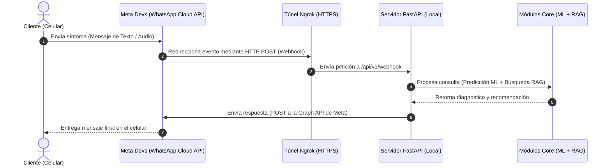

# Guía Técnica: Integración de WhatsApp Webhook y FastAPI para Sustentación de Tesis

Esta nota explica detalladamente el funcionamiento del Webhook de WhatsApp, su relación directa con la arquitectura modular de la tesis y cómo defender la implementación ante el jurado evaluador.

---

## 1. ¿Qué es el Webhook y para qué sirve?

El **Webhook** es un canal de comunicación asíncrono y en tiempo real. En lugar de que nuestro servidor de Python esté constantemente preguntando a WhatsApp si hay nuevos mensajes (técnica de sondeo o *polling*), los servidores de Meta (WhatsApp) notifican de forma activa a nuestro servidor cada vez que ocurre un evento relevante (por ejemplo, cuando un cliente envía un texto o un audio).

Para realizar las pruebas de desarrollo local, se utiliza **Ngrok** como un túnel seguro que expone nuestro puerto local `8000` a una URL pública con protocolo HTTPS, permitiendo que Meta pueda comunicarse con nuestro entorno de desarrollo.

### Diagrama de Flujo de Comunicación (Webhook)

---

## 2. ¿Cómo se relaciona con el Informe de Tesis?

Esta arquitectura basada en Webhooks no es solo un detalle de programación, sino que forma parte de la **Variable Independiente** y la **Arquitectura Tecnológica** descrita en tu tesis:

1. **Eficiencia del Canal (Webhook asíncrono)**:
   * **Ubicación en el informe**: [analisis_problema_y_arquitectura.md](file:///c:/Users/leonc/OneDrive/Desktop/CHAT_BOT_MACHINLEARNING/documentacion/analisis_problema_y_arquitectura.md#L72-L73).
   * **Sustento**: El webhook estructurado en `src/interfaces/api/v1/endpoints/webhook.py` responde inmediatamente a Meta con un código de estado `HTTP 200 OK`. Esto evita que los servidores de Meta consideren la conexión como caída (timeout) mientras los algoritmos de Machine Learning y LLM procesan la respuesta de forma asíncrona.
   
2. **Capa de Presentación y Canal Conversacional**:
   * **Ubicación en el informe**: [guia_defensa_tesis.md](file:///c:/Users/leonc/OneDrive/Desktop/CHAT_BOT_MACHINLEARNING/documentacion/guia_defensa_tesis.md#L80) y [TESIS_CHATBOL_ML with WhatsApp.md](file:///c:/Users/leonc/OneDrive/Desktop/CHAT_BOT_MACHINLEARNING/documentacion/TESIS_CHATBOL_ML%20with%20WhatsApp.md#L29-L37).
   * **Sustento**: Define el bloque de entrada natural del usuario por WhatsApp y la verificación obligatoria mediante el `Verify Token` (`MI_TOKEN_DE_VERIFICACION_SEC_123`) requerido por la seguridad de Meta Cloud API.

---

## 3. Resumen de Sustentación ante el Jurado

Si el jurado evaluador te pregunta cómo se conecta el chatbot a la red telefónica real de WhatsApp o cómo interactúa el algoritmo de Inteligencia Artificial con el usuario final, puedes responder utilizando este resumen técnico:

> *"La interfaz conversacional del sistema se implementa mediante la **API de WhatsApp Cloud de Meta**, conectada a nuestro backend de **FastAPI** a través de un **Webhook** seguro expuesto con **Ngrok**. Cuando el usuario ingresa un síntoma por mensaje de texto o audio, Meta genera una petición HTTP POST asíncrona hacia nuestro webhook. El servidor recibe los datos en la Capa de Presentación, invoca los modelos de clasificación de **Machine Learning (Random Forest)** y recuperación de datos **RAG**, y envía la respuesta final directamente al celular del cliente a través de una petición HTTP a la API de Meta."*
